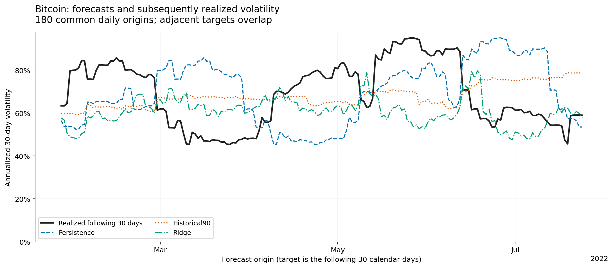
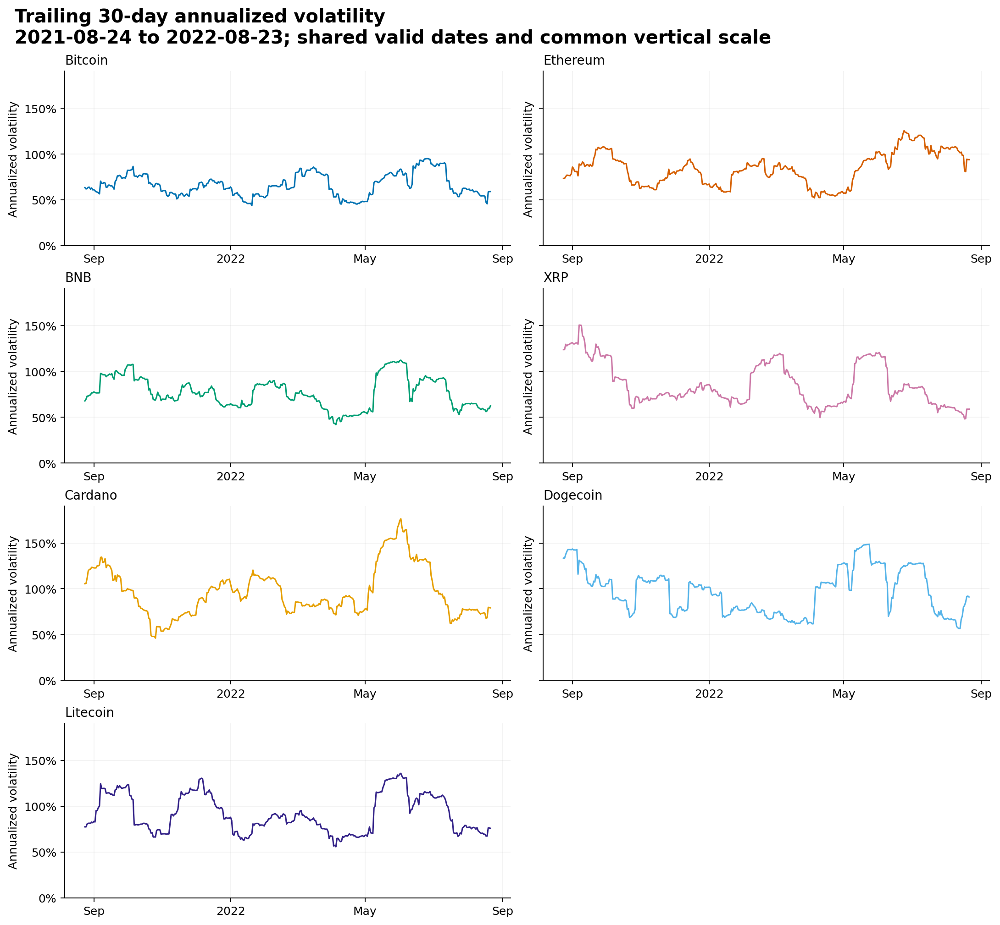

# Cryptocurrency Volatility Prediction

Historical cryptocurrency risk analysis and forecasting in Python: validate daily price histories, describe returns and drawdowns, and compare next-30-day volatility forecasts using chronological evaluation.

**Question:** can a regularized regression on trailing return features forecast the next 30 days' realized volatility better than naive baselines? On this dataset, no. The reference study covers **98 asset histories**, with **86 assets** eligible for scored forecasts. **Ridge regression did not improve average error over the simple baselines.** The value of the experiment is its explicit forecast target, data-quality controls, dated predictions, and reproducible evaluation.



## Results

The reference run scores **15,228 asset-origin observations per model**. Errors below are in annualized volatility **percentage points**; lower is better. Macro scores average per-asset errors equally, so macro RMSE is the average of per-asset RMSEs, not a pooled RMSE.

| Model | Daily-origin MAE | Daily-origin RMSE | 30-day-spaced MAE |
| --- | ---: | ---: | ---: |
| Persistence | 31.63 | 39.75 | 32.40 |
| Historical90 | 30.85 | 38.50 | 32.37 |
| Ridge | 31.96 | 40.32 | 34.62 |

Daily coverage is **86.8%** of 17,544 requested asset-origin observations; 12 histories lack sufficient usable initial training data. The 30-day-spaced sample scores 510 of 585 requested observations. Assets can have different evaluation endpoints. These are retrospective comparisons on a historical snapshot, not evidence of a trading edge or current market forecasts.

Read the [full generated report](results/reference/report.md), or inspect the [per-asset scores](results/reference/backtest_metrics.csv), [aggregate scores](results/reference/macro_metrics.csv), [dated predictions and training cutoffs](results/reference/backtest_predictions.csv), and [failures and exclusions](results/reference/model_status.json).

## Reproduce

Use Python **3.9–3.12** and run from this directory. Dependencies are pinned to the reference run's versions; it used Python 3.11.7. Other supported environments may produce small floating-point differences.

```bash
python3 -m venv .venv
source .venv/bin/activate
python -m pip install -r requirements.txt
python -m unittest discover -s tests -t . -v
python -m crypto_volatility --data data/sample --output results/sample
python scripts/verify_results.py results/sample
```

On Windows, activate the environment with `.venv\Scripts\activate`. The tests need no download. The [sample](data/sample) holds eight major-asset histories (under 1 MB) copied byte for byte from the source dataset. The uploader publishes the dataset on Kaggle under CC0 (public domain) and says the prices were collected by web scraping and with Python packages such as investpy, a Yahoo Finance client and pandas-datareader. The sample run takes a few seconds. Each asset's model is fitted separately, so its forecasts, per-asset errors and latest forecasts match the reference rows for those assets; a test enforces this.

To reproduce the full reference run, download the 98 histories first:

```bash
python scripts/download_data.py
python scripts/verify_results.py results/reference
python -m crypto_volatility --output results/my_run
python scripts/verify_results.py results/my_run
```

The downloader verifies the source ZIP and every CSV against [the source manifest](data/source_manifest.json) and publishes them to `data/raw/` in one atomic step. If the network download fails, obtain the matching ZIP from the [Kaggle dataset](https://www.kaggle.com/datasets/kaushiksuresh147/top-10-cryptocurrencies-historical-dataset) and run `python scripts/download_data.py --zip /path/to/archive.zip`. Changed downloads fail checksum verification. Skip downloading if matching CSVs already exist in `data/raw/`. The analysis runs locally without a GUI or network once the data is present.

Each analysis requires a new output directory; without `--output`, a run writes to a fresh `results/run-<UTC timestamp>/`. A run produces a full `report.md`, six figures, tables, forecasts, and `validated_daily_history.csv`. The full raw data and the 17 MB cleaned history are excluded from this repository; the reference folder contains the report, the selected derived results, and chart inputs.

For a smaller experiment:

```bash
python -m crypto_volatility --assets bitcoin ethereum --output results/btc_eth
python -m crypto_volatility --help
```

`--test-days`, `--min-train`, and `--refit-every` change the experiment and are recorded in the run metadata. They do not change the 30-day forecast horizon.

## Data and descriptive analysis

The recorded Kaggle snapshot contains **127,745 source price rows**, spanning **18 July 2010–23 August 2022**, across 98 histories and a separate static leaderboard. Coverage differs by asset. This is the vendor's historical cross-section, not a point-in-time market universe; the leaderboard is excluded from modeling. See the [data conventions](data/README.md).

Validation identified **650 missing calendar days** and **610 nonpositive closes**. Missing and invalid prices remain missing, with no interpolation or forward filling. Returns require consecutive valid calendar-day prices; a 30-day estimate requires 31 consecutive valid closes. Dates must be ISO 8601 labels (`YYYY-MM-DD`); a file with any other date layout is rejected rather than reordered. OHLC inconsistencies are audited separately from Close. See the [file-level audit](results/reference/data_validation.csv) and [dated quality events](results/reference/data_quality_events.csv).

[Summary statistics](results/reference/summary_statistics.csv) include daily log-return moments, price ranges, observed-price drawdowns, annualized volatility, and reported volume. Prices are labeled USD by the source; volume units and exchange close times are not established. Volume is normalized within each asset for visualization and excluded from the forecasting features. Zero volumes remain observed zeros, and missing dates can conceal deeper drawdowns.



The illustrative major-asset panel compares common dates from August 2021 to August 2022. Other figures show [indexed prices](results/reference/figures/indexed_prices.png), [return distributions](results/reference/figures/return_distributions.png), [return correlations](results/reference/figures/return_correlations.png), and [relative reported volume](results/reference/figures/normalized_volume.png). Their [common-window statistics](results/reference/common_window_statistics.csv) and chart inputs are saved beside the figures.

## Forecast design

For daily closes, `r_t = log(S_t) - log(S_(t-1))`. At the close of day `t`:

```text
trailing_volatility(t) = sqrt(365) * std(r_(t-29), ..., r_t; ddof=0)
target(t)             = sqrt(365) * std(r_(t+1), ..., r_(t+30); ddof=0)
```

The target uses the **next 30 daily returns**, with the population denominator 30. Features and labels are both computed from the same daily log returns. Volatility and errors in CSV files are decimals: `0.80` means 80% annualized volatility. Annualization is a reporting convention.

| Model | Specification |
| --- | --- |
| Persistence | Today's trailing 30-day volatility |
| Historical90 | Today's trailing 90-day volatility |
| Ridge | Nine features: volatility, mean absolute return, and mean return over 7, 30, and 90 days; standardized inputs, fixed alpha 1, and a `log1p(target)` response |

Ridge is fitted separately for each asset. Predictions are inverted with `expm1`; negative forecasts are clipped to zero and flagged. Fit failures and nonfinite forecasts remain explicit. All three models use the same eligible forecast dates and require the full 90-day feature history.

The default evaluation uses up to 180 daily forecast origins, at least 250 matured training examples, expanding histories, and refits every 30 calendar days. Training requires `target_end <= forecast_origin`; scaling uses only those eligible training rows. Earlier test outcomes may enter later fits once their full labels have matured. No model or hyperparameter is selected using these test errors.

Adjacent targets overlap by 29 returns, so observations are dependent. A fixed 30-day-spaced evaluation reduces direct overlap without moving the schedule around missing data. Its small sample remains descriptive. Changing asset coverage, selection bias, uncertain source conventions, and lack of calibrated prediction intervals limit interpretation.

## Implementation and verification

| Component | Purpose |
| --- | --- |
| [data.py](crypto_volatility/data.py) | Calendar validation, daily returns, and volatility calculation |
| [model.py](crypto_volatility/model.py) | Features, expanding-window fitting, baselines, and matched-date scoring |
| [report.py](crypto_volatility/report.py) | Statistics, figures, and generated analysis report |
| [\_\_main\_\_.py](crypto_volatility/__main__.py) | Command line, run metadata, and failure-safe output writing |
| [download_data.py](scripts/download_data.py) | Checksum-verified download with an atomic publish step |
| [verify_results.py](scripts/verify_results.py) | Independent recalculation of target windows, per-asset and aggregate scores, latest-forecast dates and persistence values, training cutoffs, and source/code hashes |
| [tests/](tests/) | Numerical, missing-data, chronology, download, and reporting regressions; an end-to-end run on synthetic inputs; the sample reproduction; and a check that the reference results came from the committed code |

The [reference metadata](results/reference/run_metadata.json) records settings, versions, the data directory, source hashes, and code hashes. The [verification summary](results/reference/validation_summary.json) records independent recalculation checks. GitHub Actions lints the code, runs the tests on Python 3.9 and 3.12 without downloading the dataset, and checks the command line.

[next_forecasts.csv](results/reference/next_forecasts.csv) contains projections from each asset's **last historical date**, with explicit target dates and unavailable forecasts. These are not live forecasts.
