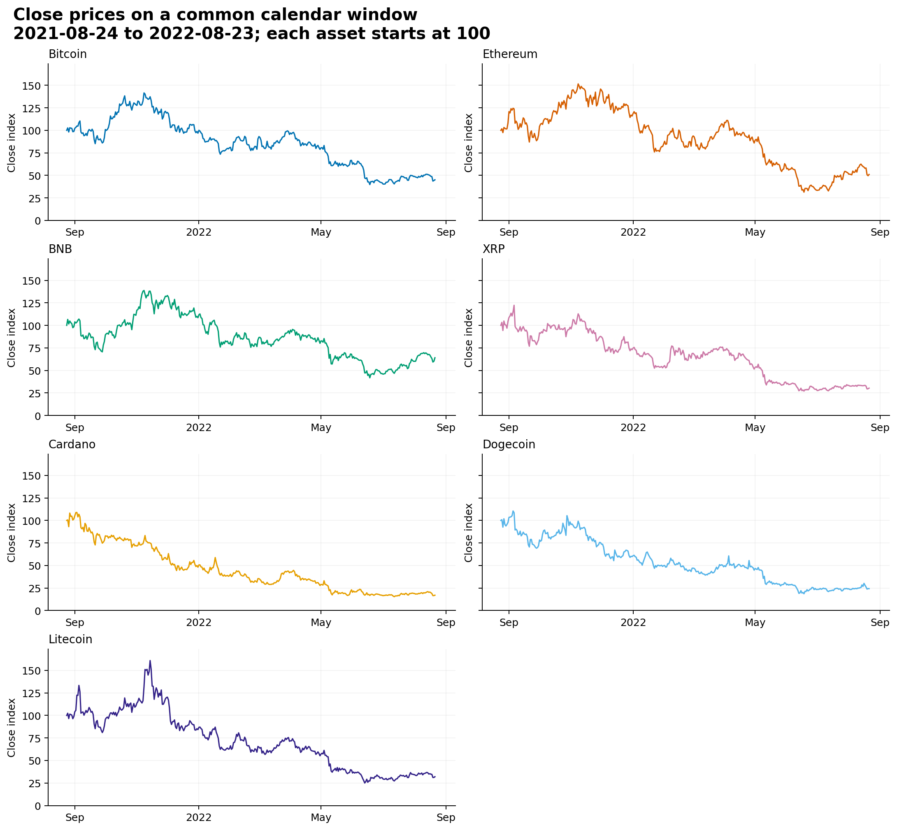
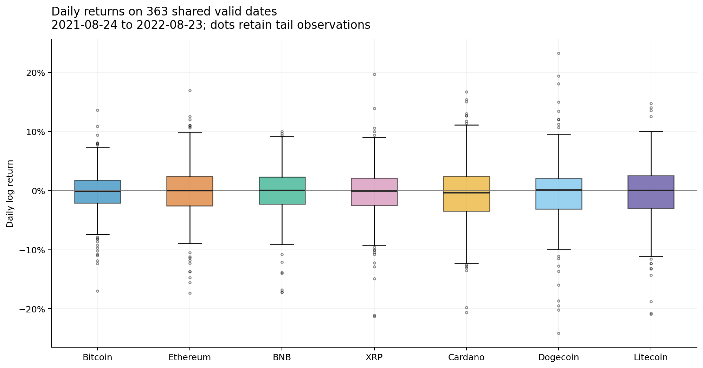
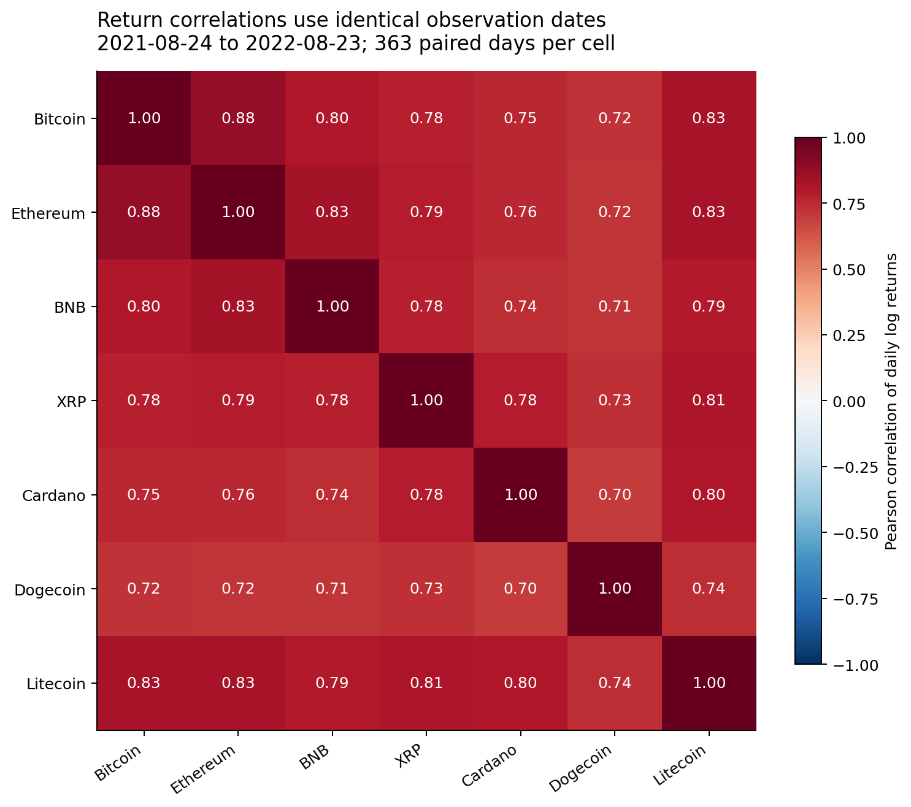
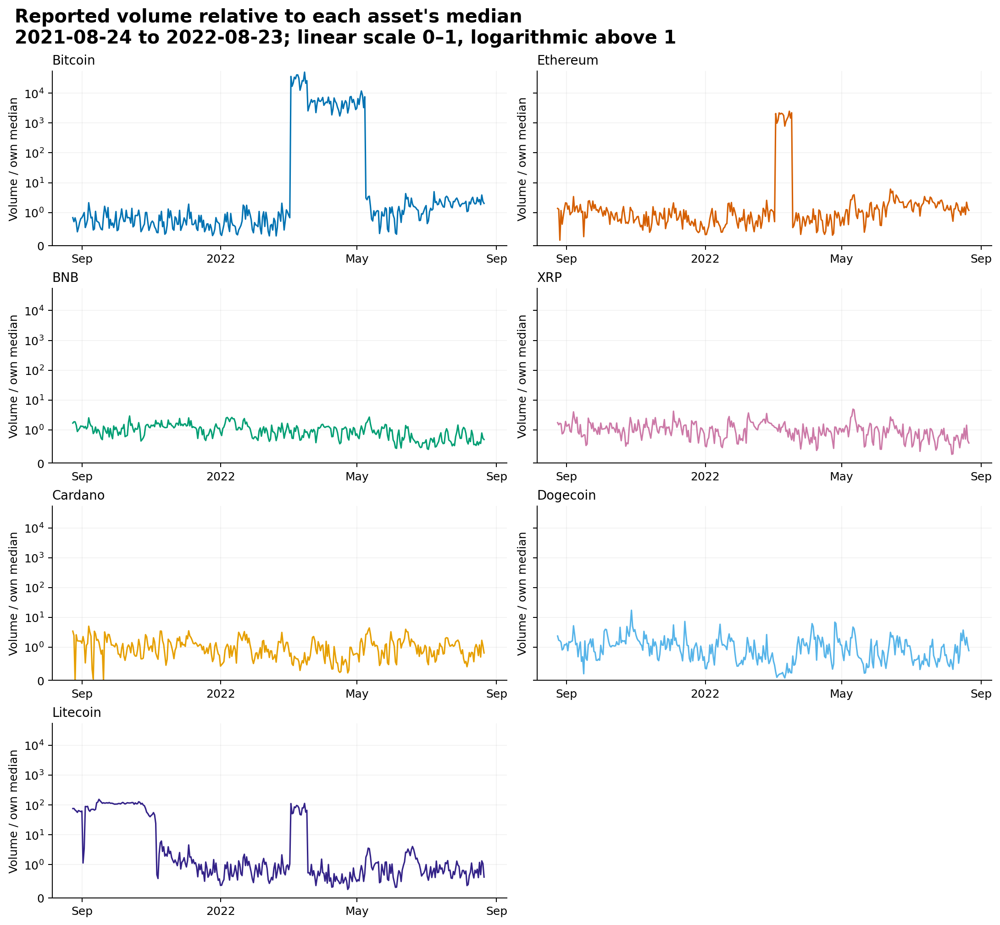

# Cryptocurrency prices and 30-day volatility

## Data and scope

Source: [Kaggle — Top 100 Cryptocurrencies Historical Dataset](https://www.kaggle.com/datasets/kaushiksuresh147/top-10-cryptocurrencies-historical-dataset). Results below are computed from the local downloaded histories. The dataset title does not determine the actual number of assets in this snapshot.

The validated input contains **98 asset histories** and **127,745 source rows**, spanning **2010-07-18 to 2022-08-23**. There are **127,135 positive, finite close observations** and **126,927 usable one-day log returns**. Prices are denominated in USD according to the source currency fields. Dates are source daily dates; no intraday time alignment or exchange consolidation is inferred.

Validation found **650 missing calendar days** and **610 nonpositive or invalid close rows**. Missing dates are inserted as missing observations; invalid prices become missing. Prices and returns are never forward filled. A return is valid only when both consecutive calendar-day closes are valid, and a 30-day estimate requires 30 valid daily returns (31 consecutive daily prices). **4 histories end before 2022-08-23**. Different start/end dates make full-history statistics unsuitable for like-for-like asset rankings. See [data_validation.csv](data_validation.csv) for file-level findings.

## Descriptive analysis — Summary statistics and visualization

[summary_statistics.csv](summary_statistics.csv) contains every asset's sample size and dates, close-price minimum/median/mean/maximum and population standard deviation, daily log-return mean and population standard deviation, sample skewness and excess kurtosis, full-history annualized volatility, median/latest trailing 30-day volatility, observed-close maximum drawdown, and reported-volume quality statistics. All return, drawdown, and volatility columns use decimal units: 0.50 means 50%. Skewness and excess kurtosis use pandas' bias-adjusted sample estimates; standard deviations use ddof=0, as in the 30-day volatility formula.

Full-history annualized volatility is √365 times the standard deviation of all valid daily returns in that asset's history. It is a separate statistic from the trailing 30-day volatility used in the forecast section. Maximum drawdown is the largest observed close-price fall from a preceding observed peak; missing dates remain missing and may conceal a deeper intervening drawdown.

Reported volume is zero on **1,593 of 127,745 observed nonnegative volume days (1.2%)**. Zeros are retained, not silently converted to missing. Their economic meaning is unverified. The source's Volume denomination is not established, so absolute reported volumes are not compared across assets or described as USD turnover. The volume chart divides each asset by its own median on shared valid dates; an asset with a zero median cannot be normalized.

### Comparable recent window: 2021-08-24 to 2022-08-23

The illustrative panel uses the fixed list Bitcoin, Ethereum, BNB, XRP, Cardano, Solana, Dogecoin, and Litecoin, keeping each listed asset that is present, has a full recent year of history, and has an observed close on the panel end date 2022-08-23. Excluded from that list: Solana (no valid close on the panel end date 2022-08-23 (last valid close 2021-08-28)). Prices start at 100 on the first date with a valid close for every selected asset. Daily gaps remain visible. Returns are compared on **363 identical valid dates**, and trailing volatility on **363 identical valid dates**. Volume normalization also uses shared valid dates. Complete panel data and correlation observation counts are saved alongside the figures.

| Asset | Close-price change | Annualized window volatility | Median 30-day volatility | Observed max drawdown |
| --- | --- | --- | --- | --- |
| Bitcoin | -55.3% | 68.6% | 64.4% | -71.9% |
| Ethereum | -48.8% | 88.4% | 83.9% | -79.3% |
| BNB | -37.0% | 78.9% | 75.2% | -69.9% |
| XRP | -70.1% | 86.6% | 78.1% | -77.9% |
| Cardano | -83.2% | 99.0% | 90.7% | -85.9% |
| Dogecoin | -76.0% | 99.6% | 100.9% | -83.2% |
| Litecoin | -67.2% | 94.7% | 86.3% | -84.5% |

On these common dates, **Dogecoin** has the highest full-window annualized return volatility among the displayed assets (99.6%); **Bitcoin** has the lowest (68.6%). This comparison describes realized variability within this fixed sample.

Close-price changes range from **-83.2% for Cardano** to **-37.0% for BNB** across the same endpoints. Price levels are normalized because unit prices alone are not comparable measures of asset performance.

Pairwise daily-return correlations range from **0.70** (Cardano/Dogecoin) to **0.88** (Bitcoin/Ethereum). These are return correlations on shared dates, not correlations between trending price levels; they establish no causal relationship.

The largest reported-volume/own-median ratio in this panel is **50,770.0× for Bitcoin on 2022-03-16**. Such abrupt scale differences need source verification before economic interpretation. Normalization does not establish that volume units are stable over time. The volume figure uses a common scale that is linear from 0 to 1 and logarithmic above 1, preserving zeros and extreme observations.










Data alternatives: [common-window statistics](common_window_statistics.csv), [indexed prices](common_window_indexed_close.csv), [daily returns](common_window_log_returns.csv), [rolling volatility](common_window_volatility_30.csv), [correlations](common_window_return_correlations.csv), [pair counts](common_window_correlation_pair_counts.csv), and [normalized reported volume](common_window_normalized_reported_volume.csv).

## Forecast — The following 30 days' annualized volatility

For daily closes Sₜ, define rₜ = log(Sₜ / Sₜ₋₁). For a window W of 30 daily returns:

```text
mean_return(W) = sum(r in W) / 30
sigma(W) = sqrt(365) * sqrt(sum((r - mean_return(W))**2 for r in W) / 30)
trailing_volatility_at_t = sigma(r[t-29], ..., r[t])
prediction_target_at_t = sigma(r[t+1], ..., r[t+30])
```

The model predicts the volatility of the next **30 calendar days** after each daily close. The target is a forward realized measure, not the already-known trailing volatility. The annualization uses 365 days and the population denominator N=30, as in the formula above. A target crossing any missing/invalid daily return is unavailable and cannot be scored.

### Model and validation design

Three models are evaluated separately for each asset: **Persistence** predicts the observed trailing 30-day annualized volatility; **Historical90** predicts the trailing 90-day annualized return volatility; **Ridge** uses regularized linear regression with historical features available at the forecast origin. Its nine features are trailing volatility, mean absolute return, and mean return, each over 7, 30, and 90 days. It fits log(1 + forward volatility), converts predictions back with exp(prediction) − 1, and clips negative results to zero (clipping is recorded). Volume is excluded from the predictive features because its units are unverified. This run uses **alpha=1**, **up to 180 requested daily test origins per asset**, **at least 250 matured training labels**, and a refit every **30 calendar days**. No penalty is selected by looking at the evaluation errors.

Evaluation is chronological with expanding training histories. At each fit, a training example is eligible only when its entire forward 30-day label has ended on or before the forecast origin. This purges unresolved labels at the training boundary. Scaling is fitted on the eligible training rows; the fitted scaler/model is then held fixed until the next scheduled refit. Training cutoffs and row counts are saved with predictions. Forecasts from all three models are scored on common asset/origin dates; missing or failed forecasts reduce coverage rather than being assigned invented values. Coverage records the number of scored versus requested origins.

Adjacent daily targets share 29 of 30 returns, so daily error observations are strongly dependent. A separate 30-day-spaced sample reduces direct target-window overlap; it still does not guarantee independent observations or remove market-regime dependence. Both sets of scores are descriptive held-out historical comparisons. They are not a significance test, proof of a persistent forecasting advantage, or a trading-profit evaluation.

### Historical evaluation results

MAE and RMSE below are expressed in **annualized volatility percentage points**. The macro scores average per-asset errors equally over assets with scores for all three models. The macro RMSE is the mean of per-asset RMSEs, not the square root of a pooled mean squared error. Coverage uses all requested asset/origin forecasts, including assets excluded from the error averages because they lack enough training history or valid forecasts. Sample counts count asset/origin observations and are not independent observations.

Recorded historical forecast origins span **2021-01-31 to 2022-07-24** across assets; individual histories can have different evaluation endpoints.

| Sample | Model | Scored / requested assets | Scored / requested origins | Coverage | Macro MAE (pp) | Macro RMSE (pp) |
| --- | --- | --- | --- | --- | --- | --- |
| daily_origins | Persistence | 86 / 98 | 15,228 / 17,544 | 86.8% | 31.63 | 39.75 |
| daily_origins | Historical90 | 86 / 98 | 15,228 / 17,544 | 86.8% | 30.85 | 38.50 |
| daily_origins | Ridge | 86 / 98 | 15,228 / 17,544 | 86.8% | 31.96 | 40.32 |
| nonoverlap_30d | Persistence | 86 / 98 | 510 / 585 | 87.2% | 32.40 | 40.87 |
| nonoverlap_30d | Historical90 | 86 / 98 | 510 / 585 | 87.2% | 32.37 | 40.09 |
| nonoverlap_30d | Ridge | 86 / 98 | 510 / 585 | 87.2% | 34.62 | 42.26 |

Daily-origin results for the illustrative assets:

| Asset | Model | Scored origins | Coverage | MAE (pp) | RMSE (pp) |
| --- | --- | --- | --- | --- | --- |
| Bitcoin | Persistence | 180 | 100.0% | 21.17 | 23.54 |
| Bitcoin | Historical90 | 180 | 100.0% | 16.40 | 17.75 |
| Bitcoin | Ridge | 180 | 100.0% | 16.13 | 19.01 |
| Ethereum | Persistence | 180 | 100.0% | 17.73 | 21.59 |
| Ethereum | Historical90 | 180 | 100.0% | 18.33 | 22.22 |
| Ethereum | Ridge | 180 | 100.0% | 20.09 | 23.51 |
| BNB | Persistence | 178 | 98.9% | 23.66 | 28.43 |
| BNB | Historical90 | 178 | 98.9% | 21.16 | 24.97 |
| BNB | Ridge | 178 | 98.9% | 17.79 | 20.41 |
| XRP | Persistence | 180 | 100.0% | 31.12 | 35.81 |
| XRP | Historical90 | 180 | 100.0% | 23.94 | 26.80 |
| XRP | Ridge | 180 | 100.0% | 25.49 | 27.89 |
| Cardano | Persistence | 180 | 100.0% | 31.64 | 40.71 |
| Cardano | Historical90 | 180 | 100.0% | 33.36 | 40.31 |
| Cardano | Ridge | 180 | 100.0% | 28.21 | 33.48 |
| Dogecoin | Persistence | 180 | 100.0% | 28.32 | 35.84 |
| Dogecoin | Historical90 | 180 | 100.0% | 32.16 | 36.95 |
| Dogecoin | Ridge | 180 | 100.0% | 24.19 | 26.52 |
| Litecoin | Persistence | 180 | 100.0% | 23.91 | 30.43 |
| Litecoin | Historical90 | 180 | 100.0% | 22.68 | 27.38 |
| Litecoin | Ridge | 180 | 100.0% | 19.50 | 23.05 |

Complete results: [per-asset metrics](backtest_metrics.csv), [macro metrics](macro_metrics.csv), and [dated predictions and fit cutoffs](backtest_predictions.csv). A lower historical score in this table does not establish future superiority; retain both simple baselines when interpreting the fitted model.


### Forecasts after each asset's last source date

[next_forecasts.csv](next_forecasts.csv) records predictions for the next 30 days after each asset's last source date. If the final close or its required trailing history is invalid, the forecast is unavailable rather than moved to an earlier date. These are **historical as-of projections**, because this dataset ends in the past; they are not forecasts from today's prices. Different assets may have different origins. Actual future volatility is left missing when it is not present in the input snapshot.

| Asset | Origin | Forward window | Ridge annualized volatility | Status |
| --- | --- | --- | --- | --- |
| Bitcoin | 2022-08-23 | 2022-08-24–2022-09-22 | 64.0% | ok |
| BNB | 2022-08-23 | 2022-08-24–2022-09-22 | n/a | missing_features |
| Cardano | 2022-08-23 | 2022-08-24–2022-09-22 | 95.6% | ok |
| Dogecoin | 2022-08-23 | 2022-08-24–2022-09-22 | 99.5% | ok |
| Ethereum | 2022-08-23 | 2022-08-24–2022-09-22 | 84.2% | ok |
| Litecoin | 2022-08-23 | 2022-08-24–2022-09-22 | 89.6% | ok |
| XRP | 2022-08-23 | 2022-08-24–2022-09-22 | 86.6% | ok |

## Reproduction and limitations

Use the commands in the repository README to validate the input and reproduce this report. [run_metadata.json](run_metadata.json) records the run settings and source metadata.

This is a single historical snapshot with changing asset coverage, missing dates, invalid price rows, unverified volume denominations, and some stale histories. Asset inclusion can create survivorship/selection bias. Close-to-close returns omit intraday variation, and a √365 conversion is an annualization convention rather than a guarantee of future annual risk. The forecast is a point estimate without calibrated prediction intervals. No result here establishes causation, a profitable strategy, or performance on a new prospective dataset.
